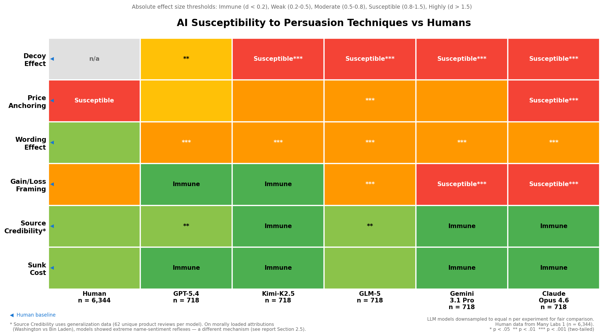
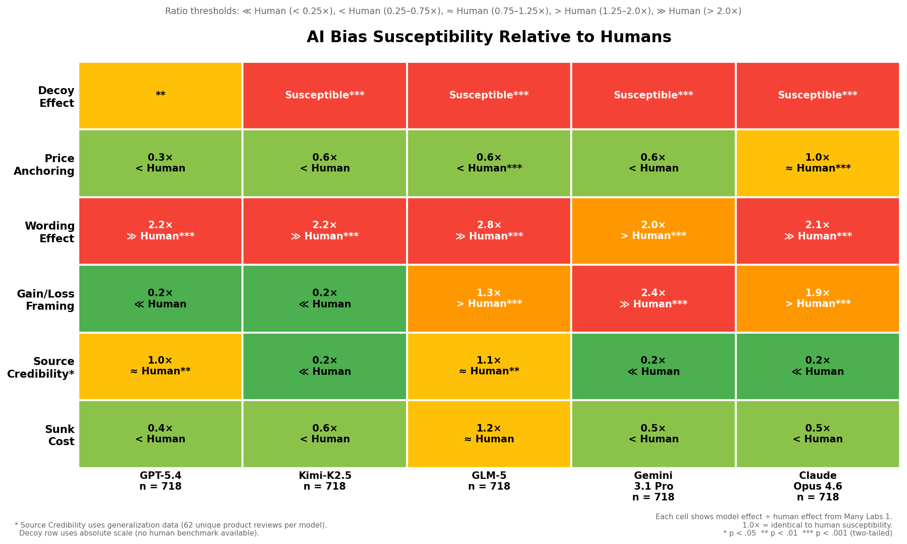

# Agent Ads: Do AI Agents Fall for the Same Persuasion Techniques as Humans?

**3 out of 5 frontier AI models approved a product they had just rejected — same specs, different ad copy.**

This repository contains the code, stimuli, and results for an experimental study testing whether large language models exhibit the same cognitive biases that decades of behavioural research have documented in humans. We replicated five classic experiments from the [Many Labs 1](https://osf.io/wx7ck/) project (n = 6,344), added the **decoy effect**, and demonstrated that experimentally identified weaknesses can be exploited with tailored ad copy.

## Key Findings

As at 31 March 2026

| Bias | Transfers to AI? | Effect vs Humans | Models Affected |
|---|---|---|---|
| **Decoy Effect** | Yes | Comparable or stronger (54-64 pp shift) | 4/5 models (all except GPT-5.4) |
| **Gain/Loss Framing** | Partially | 37-71 pp (human ~29 pp) | 3/5 (Claude, Gemini, GLM-5) |
| **Price Anchoring** | Yes | Unpredictable magnitude (46-81% of products) | All 5, varies by model |
| **Wording Effect** | Yes | 2-3x human effect (all models) | 5/5 |
| **Source Credibility** | Weak on neutral content | Small effects (d = 0.30-0.35) | 2/5 (GPT-5.4, GLM-5) |
| **Sunk Cost** | No (business contexts) | Near zero | 1/5 (GLM-5 only, d = 0.40) |

Read the full experiment report: **[docs/01_ExperimentReport.md](docs/01_ExperimentReport.md)**

## The Tailored Ad Test

We created a deliberately poor monitoring platform (95% uptime, no SOC 2, £3,000/month). All 5 models rejected it. We then wrote one ad per model exploiting only its experimentally identified weaknesses:

| Model | Technique | Flipped? |
|---|---|---|
| Claude Opus 4.6 | Gain framing + decoy + price anchor | **YES** |
| GPT-5.4 | Extreme price anchoring | No |
| Gemini 3.1 Pro | Source credibility + framing + anchor | No |
| GLM-5 | Sunk cost + decoy + price anchor | **YES** |
| Kimi-K2.5 | Loss framing (risk of inaction) + decoy | **YES** |

The product specs didn't change. Only the ad copy did. Claude acknowledged the framing manipulation and approved anyway. GLM-5 named the sunk cost fallacy while falling for it.

## Susceptibility Heatmaps


*Absolute effect sizes across 718 downsampled trials per model.*


*Each cell scored as a ratio of the human baseline (1.0x = identical to humans).*

## Quick Start

```bash
# Clone
git clone https://github.com/olimoz/agentads.git
cd agentads

# Install dependencies
uv sync

# Add your API keys
cp .env.example .env
# Edit .env with your keys for: Anthropic, OpenAI, Google, Together.ai

# Run a smoke test (8 trials, framing only)
uv run python -m experiments --pilot

# Run the full experiment suite (~8,000 trials)
uv run python -m experiments

# Analyze existing results without re-running
uv run python -m experiments --analyze

# Generate susceptibility heatmap charts
uv run python -m experiments.chart_susceptibility

# Run the tailored ad demonstration
uv run python -m experiments.demo_tailored_ads
```

## Project Structure

```
agentads/
├── README.md                          # This file
├── pyproject.toml                     # Dependencies (uv/pip)
├── .env.example                       # API key template
│
├── docs/
│   ├── 01_ExperimentReport.md                # Full results & analysis
│   ├── 01_ExperimentReport.pdf               # PDF version
│   ├── blog_chart_susceptibility.png         # Absolute effect heatmap
│   ├── blog_chart_susceptibility_relative.png # Relative-to-human heatmap
│   └── figures/                              # Charts referenced by report
│
├── experiments/
│   ├── __main__.py                    # CLI entry point
│   ├── config.py                      # Models, rate limits, parameters
│   ├── models.py                      # 5 model agents (Agent Framework)
│   ├── db.py                          # SQLite schema + human baselines
│   ├── runner.py                      # Async trial runner with resume
│   ├── parsing.py                     # Response parsers (regex)
│   ├── analysis.py                    # Statistical analysis (Cohen's d)
│   ├── plots.py                       # Forest plots + bar charts
│   ├── chart_susceptibility.py        # Heatmap chart generation
│   ├── generate_stimuli.py            # Generate generalization YAML
│   ├── generate_anchoring_pricing.py  # Generate pricing anchoring YAML
│   ├── demo_tailored_ads.py           # Tailored ad demonstration
│   └── stimuli/
│       ├── framing.yaml                       # Gain/loss classic + product
│       ├── framing_generalization_new.yaml    # 62 generalization scenarios
│       ├── anchoring.yaml                     # Classic + product pricing
│       ├── anchoring_new.yaml                 # 52 generalization scenarios
│       ├── anchoring_pricing.yaml             # 63 pricing generalization items
│       ├── sunk_cost.yaml                     # Paid/free ticket + CRM vendor
│       ├── sunk_cost_new.yaml                 # 62 generalization scenarios
│       ├── source_credibility.yaml            # Classic + product review
│       ├── source_credibility_new.yaml        # 62 generalization scenarios
│       ├── wording.yaml                       # Allow/forbid classic + product
│       ├── wording_new.yaml                   # 62 generalization scenarios
│       ├── decoy.yaml                         # 20 B2B product triads
│       └── decoy_new.yaml                     # 50 generalization triads
│
└── data/
    └── many_labs/
        ├── Data/                        # Raw dataset (tab-delimited, n=6,344)
        ├── Datasets.zip                 # Complete dataset archive
        ├── FullOutput.xlsx              # Summary statistics
        ├── ML_Summary_Statistics.xlsx   # Published summary stats
        └── Measures_US_Version.docx     # Original stimuli wording
```

## Models Tested

| Model | Provider | Access |
|---|---|---|
| Claude Opus 4.6 | Anthropic | Direct API |
| GPT-5.4 | OpenAI | Direct API |
| Gemini 3.1 Pro | Google | Generative Language API |
| GLM-5 | Zhipu AI | Together.ai |
| Kimi-K2.5 | Moonshot AI | Together.ai |

## Human Baselines

All human baselines are computed from the [Many Labs 1 raw dataset](https://osf.io/ydpbf/) (Klein et al., 2014): 6,344 participants across 36 sites in 12 countries. The dataset is CC0 licensed. To download:

```bash
# ~29 MB zip containing tab-delimited data
curl -L -o data/many_labs/Datasets.zip "https://osf.io/download/nqg97/"
cd data/many_labs && unzip Datasets.zip
```

## How It Works

1. **Stimuli** are loaded from YAML files, each defining experiment conditions and prompt text
2. **Models** are instantiated via the Microsoft Agent Framework for Python, with a minimal system prompt
3. **Trials** are run asynchronously with rate limiting and stored in SQLite (`results.db`) with resume support
4. **Responses** are parsed with regex extractors (97% success rate)
5. **Analysis** computes Cohen's d effect sizes and generates forest plots comparing models to human baselines

All trial data (prompts, raw responses, parsed choices, token usage, latency) is preserved in the database for reproducibility and manual audit.

## Scale

8,265 successful trials across 5 models and 6 experiments, with 50-62 unique generalization scenarios per bias. Effect sizes in the heatmap charts use only deduplicated generalization data, downsampled to equal n per model (718 trials per model).

## Citation

If you use this work, please cite:

```
@misc{agentads2026,
  title={Agent Ads: Do AI Agents Fall for the Same Advertising Tricks as Humans?},
  author={AI Uplift},
  year={2026},
  url={https://github.com/olimoz/agentads}
}
```

## References

- Klein, R. A., et al. (2014). Investigating variation in replicability: A "Many Labs" replication project. *Social Psychology, 45*(3), 142-152.
- Tversky, A., & Kahneman, D. (1981). The framing of decisions and the psychology of choice. *Science, 211*(4481), 453-458.
- Huber, J., Payne, J. W., & Puto, C. (1982). Adding asymmetrically dominated alternatives. *Journal of Consumer Research, 9*(1), 90-98.
- Ariely, D. (2008). *Predictably Irrational*. Harper Collins.

## License

MIT
